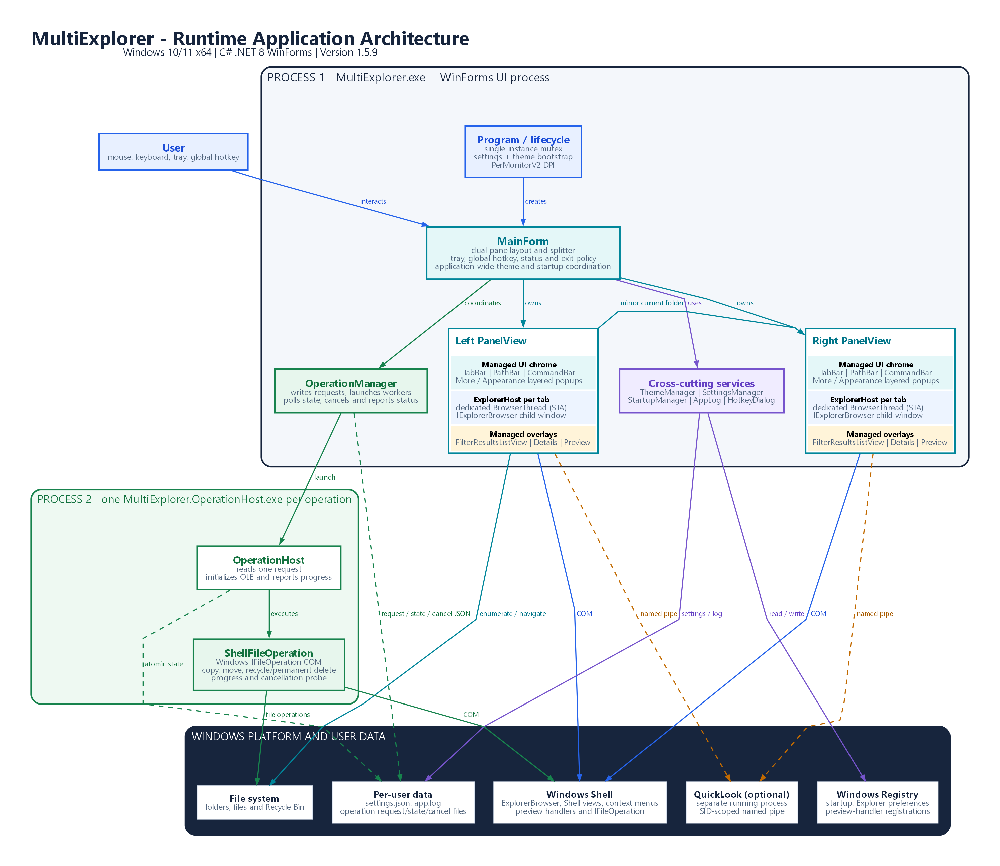
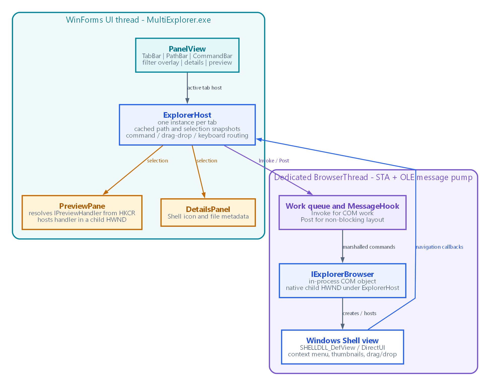
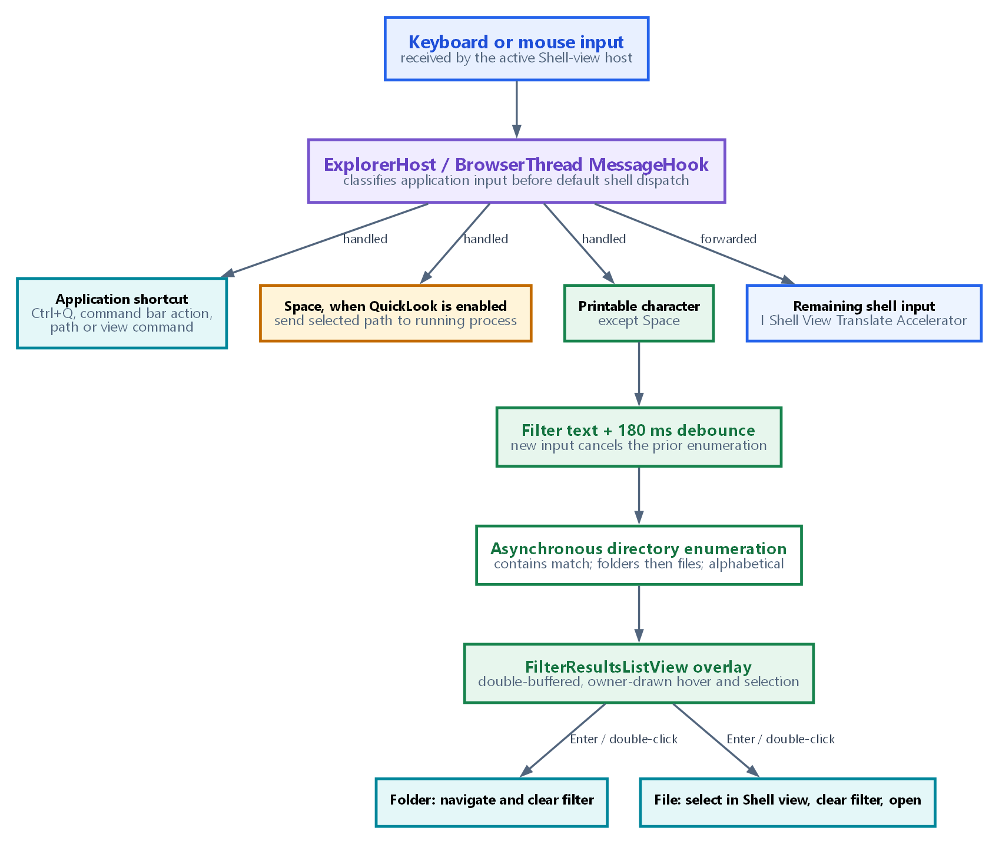
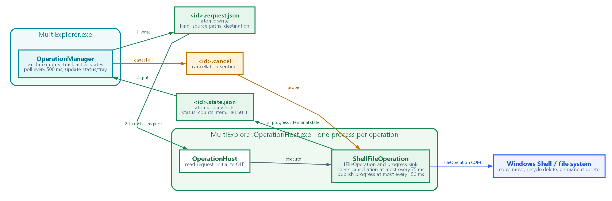

# MultiExplorer Application Architecture

**Runtime architecture reference**  
**Target:** Windows 10/11 x64  
**Implementation:** C# .NET 8 WinForms  
**Application version:** 1.5.9

This is the detailed runtime architecture reference for MultiExplorer. It covers the
normal desktop application runtime: process and thread boundaries, native Windows
Shell integration, data ownership, UI composition, file-operation isolation, and
the optional QuickLook integration. Build, test, installer, and release packaging
projects are deliberately outside this document's scope.

The [companion PDF](MultiExplorer-Application-Architecture.pdf) presents the same
material in a printable layout. The diagram sources are Graphviz DOT files under
[`architecture`](architecture/).

## 1. Runtime component view

MultiExplorer has two application-owned process types:

1. `MultiExplorer.exe` is the long-lived WinForms application. It owns the main
   window, two explorer panels, managed overlays, application preferences, status
   reporting, the notification-area icon, and coordination of background file
   operations.
2. `MultiExplorer.OperationHost.exe` is a short-lived worker process. One is
   launched for each copy, move, recycle-delete, or permanent-delete request so a
   Shell operation can progress independently of the main window.

The Windows Shell, file system, registry, per-user data, and an optional running
QuickLook process are external dependencies on the same Windows workstation.
Solid links in the diagram represent direct calls or ownership; dashed links are
asynchronous file or pipe exchanges.

## 2. Startup and application lifetime

`Program` is the composition root. Before any window is created it loads
`AppSettings`, selects the persisted (or command-line overridden) application theme,
and enables `PerMonitorV2` DPI awareness. It then constructs `MainForm` on the
WinForms UI STA and starts the application message loop.

A named mutex, `MultiExplorer.SingleInstance.v1`, makes the interactive application
single-instance. If another interactive launch occurs, the new process broadcasts a
registered `MultiExplorer.ShowInstance.v1` message and exits; the existing main
window restores and activates itself. A Windows-startup launch remains silent when
an instance is already running.

`MainForm` restores window geometry, splitter state, collapsed panes, active folder
paths and tabs. It owns the exit policy: while file operations are active it can keep
the application available, request cancellation, or exit after workers finish. The
notification-area icon can also own the visible application lifetime when
"Minimize to tray on close" is enabled.

## 3. Main window and dual-pane composition

`MainForm` owns two `PanelView` controls and a custom `SplitterBar`. The panels are
independent folder explorers: each carries its own tab collection, path history,
current path, native Shell hosts, and presentation state. The splitter can resize or
collapse either side without destroying its state.

Each `PanelView` composes the following managed UI around its active native Shell
view:

| Area | Responsibility |
|---|---|
| `TabBar` | Adds, selects, closes, and reorders tabs within or between panels. |
| `PathBar` | Breadcrumb navigation, child-folder menus, direct path editing, and per-panel history. |
| `CommandBar` | Shell commands, view options, optional panes, application options, and custom More/Appearance popups. |
| `FilterResultsListView` | A managed type-to-filter overlay above the native Explorer view. |
| `DetailsPanel` | Shell icon and metadata for the current selection. |
| `PreviewPane` | Hosts a registered Windows `IPreviewHandler` in a child window. |
| `ExplorerHost` collection | One host per tab; only the active host is visible. |

The **Open in other pane** command asks `MainForm` to navigate the opposite panel to
the current folder. It is navigation mirroring, not a file copy action.

## 4. Native Explorer hosting and thread model

Every tab owns an `ExplorerHost`, and every `ExplorerHost` creates its own
`BrowserThread`. `BrowserThread` is an OLE-initialized STA with a dedicated Win32
message loop and a native child host window. `IExplorerBrowser` is created in this
apartment, then creates the Windows Shell view below that child window.

This is an intentional boundary. A Shell-initiated copy, move, delete, drag/drop,
or context-menu operation may run a nested modal loop on the thread that owns the
Shell window. Keeping the native Explorer view on a separate STA means that modal
loop does not freeze the WinForms UI thread.

Cross-thread Shell work is marshalled through `BrowserThread`:

- `Invoke` queues work and waits when a result is required, while executing directly
  if it is already on the browser thread.
- `Post` queues non-blocking work such as bounds changes, so a managed layout pass
  never waits for a native modal loop.
- `MessageHook` examines the browser thread's message stream before normal
  translation and dispatch. It is used for application-level key handling and input
  classification.

`ExplorerHost` caches paths and selected-file snapshots from navigation callbacks.
The UI can therefore poll or update visual controls without repeatedly performing
synchronous cross-thread COM calls. Shell key messages that MultiExplorer does not
own are forwarded to `IShellView::TranslateAccelerator`, retaining standard Explorer
keyboard behavior. `ExplorerHost` also provides the native context menus, drag/drop
routing, Explorer view-mode configuration, and navigation-pane synchronization.

## 5. Input, filtering, navigation, and selection

When a native Shell view is active, `ExplorerHost` first classifies the input:

- Application commands and explicit shortcuts are raised to the managed command
  layer.
- `Space`, when QuickLook is enabled, sends the selected path to the optional
  QuickLook integration rather than starting a filter.
- Other printable characters start the managed contains filter.
- Remaining keyboard input is sent back to the Shell view.

The filter is not a second Explorer instance. `PanelView` captures the text in a
small bottom bar, waits 180 ms after the most recent change, cancels any earlier
enumeration, and asynchronously scans the current directory. Results are folders
first and files second, both alphabetically sorted, with name, type, size, and
modified-date data.

The result control is a double-buffered, owner-drawn `FilterResultsListView`.
Hover changes redraw only the previously hovered and newly hovered rows, avoiding a
full-list repaint. The control uses the current application palette for unselected,
hovered, and selected rows.

Entering or double-clicking a filtered folder navigates the current host into it and
removes the overlay. Opening a filtered file first calls `ExplorerHost.SelectItemPath`
for that file, then clears the overlay and opens the default handler. The underlying
Explorer view therefore retains the same selection after the filtered list closes.

Navigation events also update the breadcrumb bar and current-path cache. `MainForm`
polls pane paths every 300 ms to keep persisted paths, tab labels, and optional
selection-driven panes current without tying these updates to a single user action.

## 6. File operations and durable IPC

`OperationManager` is the UI-side coordinator. It validates paths, allocates a GUID,
creates an initial queued state, atomically writes the request, and starts
`MultiExplorer.OperationHost.exe --request <path>`. Each operation uses these files
under `%LOCALAPPDATA%\MultiExplorer\Operations`:

| File | Writer | Reader | Purpose |
|---|---|---|---|
| `<id>.request.json` | UI | operation host | Operation kind, source paths, destination, and creation time. |
| `<id>.state.json` | operation host | UI | Progress, current item, HRESULT, worker PID, error, and terminal status. |
| `<id>.cancel` | UI | operation host | Presence requests safe cancellation. |

Writes are made by serializing to a same-directory temporary file and replacing the
target, so a reader sees a complete JSON document rather than a partially written
one. The UI polls state every 500 ms and discovers previously written operation state
on startup. If a worker exits without reporting an expected terminal state, the UI
marks the operation as failed and reports it through the log and status UI.

The worker initializes OLE, reads one request, creates Windows `IFileOperation`, and
advises a progress sink. The sink reports item completion and periodically writes a
state snapshot (no more often than every 150 ms except terminal or failure updates).
A cancellation probe checks for the sentinel at most every 75 ms and asks the Shell
operation to abort. Terminal outcomes are `Completed`, `Failed`, or `Cancelled`.

The worker uses native Shell semantics: copy and move honour the normal Shell
operation behavior, recycle delete uses the Recycle Bin, and permanent delete omits
the undo/recycle flags. This maintains the fidelity of Windows file operations while
containing the worker lifecycle separately from the UI.

## 7. Appearance, preview, and optional integrations

`ThemeManager` is the managed and native theme authority. It holds the palette,
configures ToolStrip rendering, themes managed controls, and applies native dark-mode
treatment to eligible HWNDs. A live Light/Dark change is persisted and recreates
open Explorer hosts, because a Shell DirectUI view adopts its process preference when
it is created. Path and selection state are preserved where possible through that
recreation.

The More menu and Appearance submenu are custom layered popup surfaces. Parent and
child popups coordinate their closing sequence so choosing an appearance retains the
expected menu ownership and cannot recurse through `Close` handling.

`PreviewPane` discovers the current file type's preview-handler CLSID from
classes-root registry mappings, creates the `IPreviewHandler` COM object, initializes
it with the selected item, and hosts the preview in its own child HWND. When no
handler is registered, the pane remains a graceful fallback.

QuickLook is entirely optional. If enabled, `ExplorerHost` identifies a running
QuickLook process and sends the selected file path through its SID-scoped named pipe.
MultiExplorer does not start QuickLook. A missing process, installation, or pipe
returns a specific user-visible failure while the explorer remains fully usable.

## 8. Persistence and external Windows dependencies

| Integration | Direction | Runtime purpose |
|---|---|---|
| `%APPDATA%\MultiExplorer\settings.json` | read/write | Window, panes, tabs, path history, tray, theme, hotkey, startup, and QuickLook preferences. |
| `%LOCALAPPDATA%\MultiExplorer\app.log` | write | Rolling diagnostic log; warnings and errors are also surfaced in the status bar. |
| `%LOCALAPPDATA%\MultiExplorer\Operations` | read/write | The durable request/state/cancellation IPC contract. |
| `HKCU\...\Run` | read/write | Current-user Windows sign-in launch registration. |
| Explorer preference keys | read/write | File-name extensions, hidden items, item check boxes, and compact view follow File Explorer. |
| `HKCR` mappings | read | Preview-handler discovery by extension or ProgID. |
| Windows Shell COM | in-process / worker calls | Explorer views, folders, thumbnails, context menus, drag/drop, preview handlers, and file operations. |
| QuickLook named pipe | optional outbound IPC | Sends a selected path to an already-running QuickLook process. |

The application is offline by design. It has no network service dependency and keeps
its runtime data in the current Windows user's profile.

## 9. Component reference

| Component | Source | Architectural responsibility |
|---|---|---|
| `Program` | `Program.cs` | Bootstrap, mutex, theme/settings loading, DPI mode, and message loop. |
| `MainForm` | `MainForm.cs` | Window, layout, two panels, splitter, tray, hotkey, status, exit policy, and operation coordination. |
| `PanelView` | `PanelView.cs` | Per-pane composition, tabs, filter overlay, optional panes, and command dispatch. |
| `ExplorerHost` | `ExplorerHost.cs` | One tab's Shell view, input routing, navigation, selection, drag/drop, view settings, and QuickLook. |
| `BrowserThread` | `BrowserThread.cs` | Dedicated STA/OLE host and message pump for one `IExplorerBrowser`. |
| `CommandBar` | `CommandBar.cs` | Toolbar commands and custom More/Appearance popup hierarchy. |
| `PathBar` / `TabBar` | `PathBar.cs`, `TabBar.cs` | Breadcrumb/direct navigation and custom tab presentation/reordering. |
| `DetailsPanel` / `PreviewPane` | `DetailsPanel.cs`, `PreviewPane.cs` | Selection metadata and native preview-handler hosting. |
| `OperationManager` | `OperationManager.cs` | Launches workers, polls state, handles cancellation, and drives operation UI. |
| Contracts and store | `OperationContracts.cs` | JSON schema and atomic per-operation file coordination shared by both processes. |
| `OperationHost` / `ShellFileOperation` | `MultiExplorer.OperationHost/` | Per-operation OLE worker and `IFileOperation` execution. |
| `ThemeManager` | `ThemeManager.cs` | Managed palette, menu renderer, and native dark-mode integration. |
| `SettingsManager` / `AppSettings` | `SettingsManager.cs`, `AppSettings.cs` | Persisted per-user application state. |
| `StartupManager` | `StartupManager.cs` | Current-user Run-key registration. |
| `AppLog` | `AppLog.cs` | Rolling log and warning/error notification feed. |
| `NativeMethods` | `NativeMethods.cs` | P/Invoke and Shell COM declarations. |

## 10. Architectural considerations and maintenance rules

| Concern | Implementation consequence |
|---|---|
| Responsiveness | The UI STA coordinates controls; each native Explorer view owns a separate STA. Filtering is asynchronous, debounced, and cancellable. |
| Fault containment | Shell file operations run in a separate executable; stale state and exited workers become explicit failures. |
| Windows fidelity | Native Shell interfaces perform navigation, icons, thumbnails, menus, drag/drop, previews, and operations. Installed extensions and per-user Explorer preferences therefore apply naturally. |
| Data locality | Settings use roaming AppData; logs and operation coordination use Local AppData. No application data leaves the workstation. |
| Theme and DPI | The managed palette is combined with native theming; Shell views are recreated for live theme changes; PerMonitorV2 keeps host and child rendering contexts aligned. |
| Optional dependency | QuickLook is feature-detected and does not affect core explorer operation when unavailable. |

Update this document and the four DOT diagrams when a process boundary, IPC
contract, storage location, Shell integration point, thread ownership rule, or major
UI responsibility changes. Routine visual changes normally require only a note
update unless they alter one of those boundaries.
